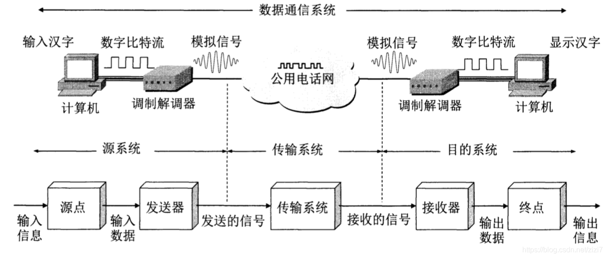

# 通信系统
## 组成
一般的通信系统可以分为三个部分:
- 源系统(发送端、发送方)
- 传输系统(传输网络)
- 目的系统(接收端、接收方)

### 源系统
- 源点(源站、信源): 产生数据的设备
- 发送器:
将信源产生的数据转换成适合传输的信号的设备(*编码*)

### 目的系统
- 接收器: 将传输的信号转换成数据的设备(*译码*)
- 终点(目的站、信宿): 接收数据的设备

[消息与信道](./消息与信道.md)
