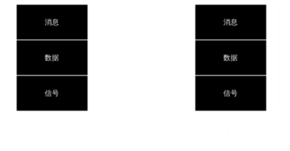

# 消息
消息的层次结构如下：
<!--  -->

- 消息: (图像, 文本, 音频, 视频……)
- 数据: 运送消息的载体[^RFC4949]
- 信号: 数据的电气或电磁表现形式
    - 模拟信号
        - 连续的
    - 数字信号
        - 离散的
        - *码元*: 代表不同离散数值的基本波形

> 消息是面向人的,
数据是面向机器的,
信号是面向信道的。

[^RFC4949]: 定义: 数据是以特定形式表现的信息

# 信道
#信道 是指向*某一方向*传送*信息* 的一种媒体

有三种基本的信道类型:
- **单向通信**(单工信道)
    - 信息只能在一个方向上传送
- **双向交替通信**(半双工信道)
    - 信息可以在两个方向上传送, 但不能同时进行
- **双向同时通信**(全双工信道)
    - 信息可以在两个方向同时进行传送
