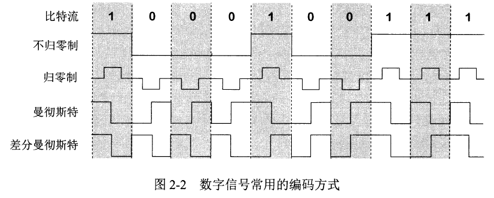
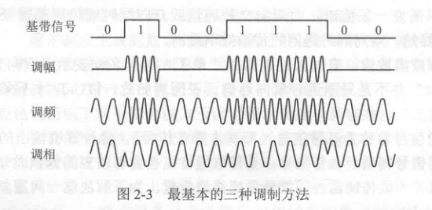

# 调制

## 基带信号
来自信号源的**[数字信号](./消息与信道.md#消息)**。
许多信道无法传输，
需要#调制 成高频信号。

## 调制
### 基带调试
仅对信号做波形变换,
以满足信道传输要求。
此时,信号依然是基带信号。

基带调制又称**编码**

#### 常用的编码方式

- *非归零制*       : 正为1 负为0
- *归零制*         : 正脉冲为1 负脉冲为0
- *曼彻斯特码*     : 位周期中心向上跳变为1,中心向下跳变为0
- *差分曼彻斯特码* : 位开始边界有跳变为0,没有跳变为1

### 带通调制
使用 *载波* 进行调制,
使信号变成高频信号。
此时,信号是带通信号。

带通调制又称**调制**

#### 基本调制方法

- *调幅* : 信号决定载波的振幅,如0为有,1为无
- *调频* : 信号决定载波的频率,如0为$f_1$,1为$f_2$
- *调相* : 信号决定载波的相位,如0为0度,1为180度

# 信道的极限容量
## 码间串扰
**奈式准则**:
在带宽为$W$的信道中,
若不考虑噪声,
则最高可达的数据传输速率为$2W$.

## 噪声
信号的平均功率为$S$,
噪声的平均功率为$N$,
#信噪比 为
$$信噪比 = 10\lg{\frac{S}{N}}\text{(db)}$$

**香农定理**:
在带宽为$W$的信道中,
极限数据传输速率为
$$C=W\log_2(1+\frac{S}{N})\text{(bit/s)}$$

## 提高单个[码元](./消息与信道.md#消息)携带的信息量

